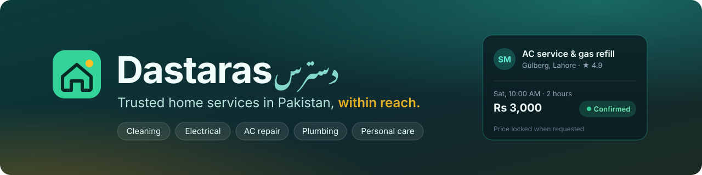
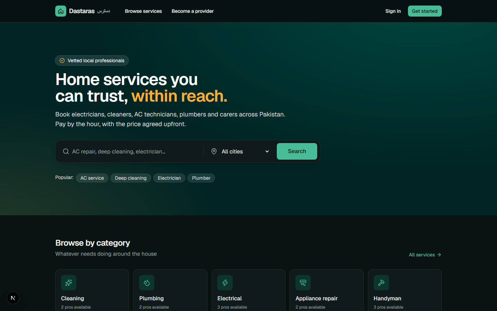
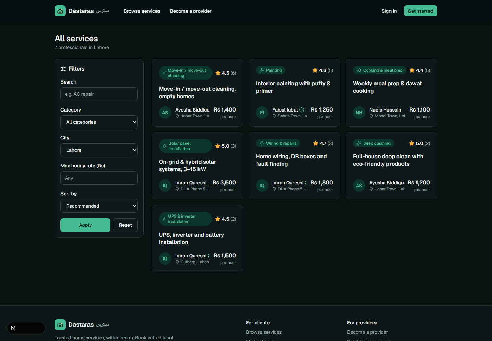
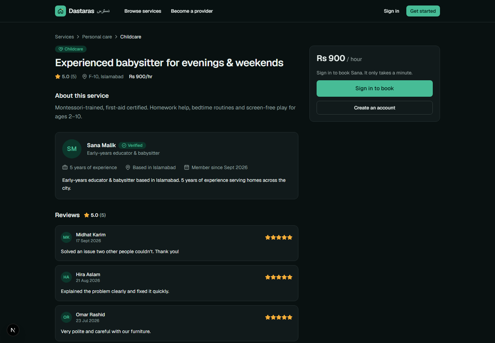
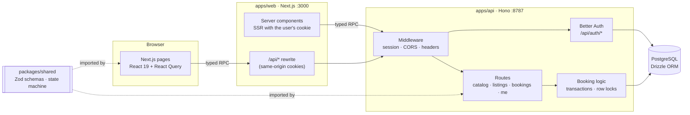
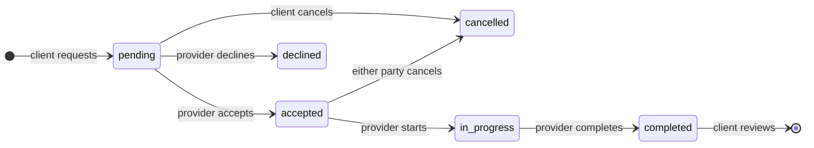

<p align="center">
  
</p>

<p align="center">
  <b>Book vetted electricians, cleaners, AC technicians, plumbers and carers across Pakistan — by the hour, with the price agreed upfront.</b>
</p>

<p align="center">
  
  
  
  
  
  
  
  
</p>

---

**Dastaras** (دسترس, _"within reach"_) is a home-services marketplace built for how Pakistan actually gets
things fixed.

## The problem

When the AC dies in June or a fuse blows at night, most people in Pakistan still find help the same way: asking
neighbours, calling a number off a wall, or hoping the local _mistri_ picks up.
- **Trust is guesswork.** You rarely know someone's track record before they walk into your home.
- **Prices are negotiated on the spot,** and often change once the job has started.
- **There's no record.** No confirmation, no timeline, no way to hold anyone accountable afterwards.

Skilled workers lose out too. Good electricians, cleaners and carers depend on word of mouth and have no way to
build a reputation that follows them.

## The idea

Put trust, time and price in writing before anyone knocks on the door.

- **Verified profiles and real reviews.** Every review comes from a completed booking, so ratings can't be faked.
- **Hourly pricing agreed upfront.** The rate is locked the moment you request, and the total is shown before you book.
- **A clear booking flow.** Request → accepted → in progress → completed, with every step logged on a timeline both sides can see.
- **A fair shop window for providers.** Their own listings, rates and areas, plus a reputation they build job by job.

## Screenshots

<p align="center">
  
</p>

<table>
  <tr>
    <td width="50%"></td>
    <td width="50%"></td>
  </tr>
  <tr>
    <td align="center"><sub>Search & filters: category, city, budget, sort</sub></td>
    <td align="center"><sub>Listing: provider profile, reviews, booking card</sub></td>
  </tr>
</table>

## Features

**For clients**
- Search by service and city, then filter by category and budget and sort by rating or price. Filters live in the URL, so results are shareable.
- Book in a few clicks: date, time slot and hours, with a **live total**. The price is locked when you request.
- Track every booking on a timeline, cancel before the job starts, and leave a review once it's done.

**For providers**
- Dashboard with new requests, upcoming jobs, earnings and average rating.
- Accept, decline, start and complete jobs; optional notes on declines and cancellations.
- Create, edit and pause listings, each with its own rate and area; edit a public profile.

**Under the hood**
- **End-to-end type safety.** The web app calls the API through a typed [Hono RPC](https://hono.dev/docs/guides/rpc) client inferred from the server routes. Rename a field and every broken page fails to compile.
- **Booking state machine** defined once in a shared package: the API enforces it, and the UI draws its buttons from the `actions` the API returns.
- **Safe writes.** Transactions, row-locked status changes, overlap checks on booking and on accept, and an append-only audit log behind every timeline.
- **One set of validation rules.** The same Zod schemas validate API requests and web forms.
- **Real tests.** Integration tests run against a real Postgres database, not mocks.

## Architecture



The monorepo has four packages, and dependencies point one way only:

| Package | What it does |
|---|---|
| [`packages/shared`](packages/shared) | Zod schemas, the booking state machine, constants (cities, PKR formatting). Pure TypeScript; runs on server and client. |
| [`packages/db`](packages/db) | Drizzle schema, SQL migrations, database client. |
| [`apps/api`](apps/api) | Hono API: auth, business rules, transactions. Exports its route types and a typed client. |
| [`apps/web`](apps/web) | Next.js App Router site. Never touches the database, only the API. |

A future Expo mobile app will plug in exactly where `apps/web` does, reusing the same API client and shared package.

### Booking lifecycle



## Tech stack

| Layer | Tools |
|---|---|
| Web | Next.js 16 (App Router), React 19, Tailwind CSS v4, TanStack Query, Better Auth client, lucide icons, Geist font |
| API | Hono 4 on Node, Better Auth (email + password, roles), Zod 4 validation |
| Data | PostgreSQL, Drizzle ORM + migrations, full-text search index |
| Tooling | pnpm workspaces, Turborepo, TypeScript (strict), Vitest, Biome |

## Getting started

**Requirements:** Node 22+, pnpm (`corepack enable`), and PostgreSQL 17+, either via Docker or installed locally.

```bash
git clone <this repo> && cd Dastaras
cp .env.example .env          # then set BETTER_AUTH_SECRET to a long random string
pnpm install
```

**Database.** Pick one:
- **Docker:** `pnpm db:up`. This starts Postgres and creates both databases.
- **Local Postgres (e.g. via pgAdmin):** run this once as a superuser:
  ```sql
  CREATE ROLE dastaras WITH LOGIN PASSWORD 'dastaras' CREATEDB;
  CREATE DATABASE dastaras OWNER dastaras;
  CREATE DATABASE dastaras_test OWNER dastaras;
  ```

Then create the tables, load demo data and start everything:

```bash
pnpm db:migrate
pnpm db:seed
pnpm dev                      # web → http://localhost:3000 · API → http://localhost:8787
```

> **Windows PowerShell 5.1:** run the commands one per line; `&&` isn't supported there.

**Demo accounts** (password `password123`): `client@dastaras.dev` to book, `provider@dastaras.dev` to run the provider dashboard.

### Scripts

| Command | What it does |
|---|---|
| `pnpm dev` | API and web in watch mode |
| `pnpm test` | Unit tests + API integration tests (needs Postgres) |
| `pnpm typecheck` · `pnpm lint` | TypeScript and Biome across the monorepo |
| `pnpm build` | Production builds |
| `pnpm db:generate` | New migration after editing `packages/db/src/schema.ts` |
| `pnpm db:seed` | Reset demo data (destructive; refuses to run in production) |

## Project structure

```
apps/
  api/        Hono API: app.ts, auth.ts, routes/, lib/bookings.ts, test/
  web/        Next.js app: app/ (pages), components/, lib/ (API + auth clients)
packages/
  db/         Drizzle schema, migrations
  shared/     Zod schemas, booking state machine, constants
docs/
  BACKLOG.md  Roadmap, decisions and open questions
```

## Roadmap

The MVP is nearly done. Next up are CI, end-to-end tests and a public demo, followed by chat, maps, payments,
an admin panel and a mobile app. The full plan, with the decisions behind it, is in
**[docs/BACKLOG.md](docs/BACKLOG.md)**.

<p align="center">
  <a href="docs/BACKLOG.md"></a>
</p>

---

<p align="center">
  Built by <b>Midhat Karim</b>
</p>
