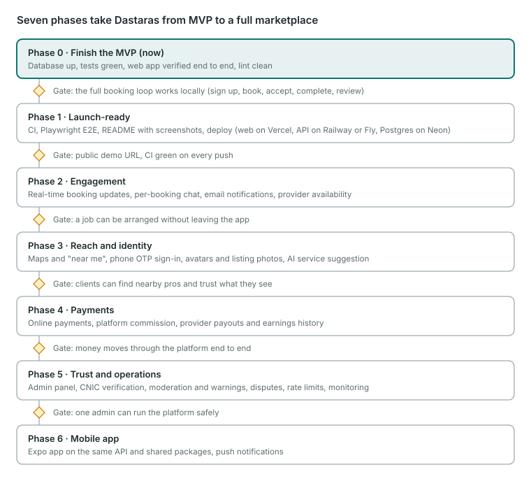

# Dastaras — Backlog & Roadmap

The single list of everything planned for Dastaras, from today's MVP to the final product.
There are seven phases, and each ends at a **gate**: the next phase starts only once the gate is met.

**How to use this file**
- Tick items as they ship (`- [x]`). Within a phase, items are in suggested order.
- New ideas go into the phase where they fit, or into [Ideas](#ideas-not-yet-scheduled) if unsure.
- Items move between phases only by a deliberate decision. Record it in [Decision log](#decision-log).

_Last updated: 2026-09-27_

---

## MVP decisions (2026-09-27)

These came out of reviewing the old FYP schema against the new one. The full mapping is in [Parked from the FYP schema](#parked-from-the-fyp-schema).

- **No CNIC in the MVP.** Accounts use an internal id. CNIC returns in Phase 5, for provider verification only.
- **Ratings are one-way:** clients rate providers.
- **No provider online/offline status.** Providers accept bookings for scheduled times.
- **Bookings are in whole hours** (1 to 12).

---

## Phase 0 — Finish the MVP (current)

**Gate:** the full booking loop works locally (sign up → book → provider accepts → starts → completes → client reviews), and `pnpm test` passes.

- [x] Monorepo, schema + first migration, seed, auth with roles
- [x] API: catalog, listings, bookings (state machine, overlap checks, row locks), reviews, `/me`
- [x] Typed RPC client (`@dastaras/api/client`)
- [x] `apps/web` built: landing, search, listing + booking form, auth, role-aware dashboard, booking detail (typecheck, lint, build pass)
- [x] MVP schema decisions (above)
- [x] Create the `dastaras` role and the `dastaras` + `dastaras_test` databases in pgAdmin
- [x] `pnpm db:migrate` and `pnpm db:seed` (9 categories, 34 services, 12 providers, 20 listings)
- [x] `pnpm test` passes locally (18 API + 7 unit tests)
- [ ] Walk through `apps/web` together and decide what to change
- [ ] Browser smoke test of the full loop, as client and as provider
- [x] Show/hide toggle on password fields (`PasswordInput`)
- [ ] **Bug:** two overlapping pending bookings accepted at the same moment can both succeed (double booking). Fix: advisory lock per provider, or an exclusion constraint _(decision needed)_
- [ ] Pending requests whose time has passed: auto-decline, hide, or leave? _(decision needed)_
- [ ] Block accept/start for jobs whose time has passed, or start earlier than N hours before? _(decision needed)_
- [ ] Fix the existing Biome errors (`seed.ts` PRNG assignment, `lib/bookings.ts` optional chain)
- [ ] Update the status section in `CLAUDE.md`

## Phase 1 — Launch-ready

**Gate:** a public demo URL, with CI green on every push.

- [ ] GitHub Actions CI: Postgres service → install → lint → typecheck → test → build
- [ ] Playwright E2E test for the core loop
- [ ] Component tests for the booking form and the dashboard action buttons
- [ ] Deploy: Postgres on Neon, API on Railway/Fly/Render, web on Vercel (the `/api` rewrite keeps cookies first-party)
- [ ] Production env and secrets checklist (`BETTER_AUTH_SECRET`, `WEB_ORIGIN`, `API_URL`)
- [ ] Demo data strategy for production (a read-only seed, or a nightly reset)
- [ ] Error tracking (e.g. Sentry) for web and API
- [ ] SEO basics: sitemap, robots, Open Graph images for listings
- [ ] README: architecture diagram, screenshots, demo link, "how it works"

## Phase 2 — Engagement

**Gate:** a job can be arranged, discussed and tracked without leaving the app.

- [ ] Email verification and password reset (Better Auth + an email provider such as Resend)
- [ ] Email notifications on request, accept, decline, cancel and complete
- [ ] Real-time booking updates on the dashboard and the booking page (SSE first)
- [ ] Per-booking chat. New `message` table: `booking_id`, `sender_id`, `body`, `created_at`, `read_at` (replaces the FYP `message` table)
- [ ] In-app notification bell with unread count
- [ ] Provider availability: working hours and blocked dates, checked when booking

## Phase 3 — Reach & identity

**Gate:** clients can find nearby pros and trust what they see.

- [ ] Locations: PostGIS point on listings/profiles, "near me" search and distance sort (replaces FYP `provider_location` / `client_location`)
- [ ] Map view on web (Leaflet or MapLibre)
- [ ] Image uploads to Cloudflare R2/S3 via presigned URLs: avatars, listing photos (replaces FYP `BYTEA` pictures)
- [ ] Phone OTP sign-in (Better Auth `phoneNumber` plugin; SMS credentials from env, **never committed**)
- [ ] AI helper: "describe your problem" → suggested service and price range
- [ ] Favourites and "book again"
- [ ] Urdu translation / RTL support _(decision needed)_

## Phase 4 — Payments

**Gate:** money moves through the platform end to end: a client pays, the provider gets paid out, and refunds work.

- [ ] Choose a gateway: Stripe (test mode) vs a local one (JazzCash / Easypaisa) _(decision needed)_
- [ ] Pay at booking vs pay after completion _(decision needed)_
- [ ] Platform commission model
- [ ] Cancellation policy and refunds
- [ ] Provider payouts and earnings history (extends `/me/stats`)
- [ ] Receipts / invoices

## Phase 5 — Trust & operations

**Gate:** one admin can run the platform safely: verify providers, handle reports and resolve disputes.

- [ ] Admin panel (the `admin` role already exists): users, listings, bookings
- [ ] Provider verification with CNIC: stored encrypted, shown masked, never a key. Drives the "Verified" badge
- [ ] Reports and moderation: warnings, suspension (replaces FYP `warning_count`)
- [ ] Dispute flow for completed or cancelled bookings
- [ ] Revisit provider → client ratings (see decision log)
- [ ] Rate limiting on public routes; OpenAPI docs (`hono-openapi`)
- [ ] Monitoring, uptime alerts, database backups

## Phase 6 — Mobile app

**Gate:** the Expo app is published to testers and uses the same API as the web.

- [ ] `apps/mobile` (Expo), reusing `@dastaras/api/client` and `@dastaras/shared`
- [ ] Auth with `@better-auth/expo`
- [ ] Push notifications for booking updates and chat
- [ ] EAS builds, then internal testing tracks (Play Store first)

---

## Ideas (not yet scheduled)

- Recurring bookings (e.g. weekly cleaning)
- Provider teams / agencies with multiple workers
- Quotes for jobs that can't be priced by the hour
- Referral codes and promotions

## Parked from the FYP schema

| Old FYP item | Decision now | Revisit in |
|---|---|---|
| `client.cnic` / `provider.cnic` as primary keys | Left out; internal ids instead | Phase 5 (verification only) |
| `provider_to_client_rating` | One-way ratings only | Phase 5 |
| `provider.status` (online/offline) | Dropped; bookings are scheduled | Only if "instant booking" is ever added |
| `duration_hrs` + `duration_mins` + `working_hours` | Whole hours, 1–12 | If shorter jobs are requested |
| `message` | Not in MVP | Phase 2 |
| `provider_location` / `client_location` | City + area for now | Phase 3 |
| `picture` / icons as `BYTEA` | Lucide icon names; images later as URLs | Phase 3 |
| `provider.warning_count` | Not in MVP | Phase 5 |

## Decision log

| Date | Decision | Why |
|---|---|---|
| 2026-09-27 | CNIC left out of the MVP | Sensitive personal data; only needed for verification |
| 2026-09-27 | One-way ratings | Keeps the MVP review flow simple; revisit with moderation |
| 2026-09-27 | No online/offline status | Bookings are scheduled, not on demand |
| 2026-09-27 | Whole-hour durations | Matches hourly pricing; simpler overlap checks |
| 2026-09-27 | Planning docs live in the repo (`docs/`) | Kept with the code and its history |
